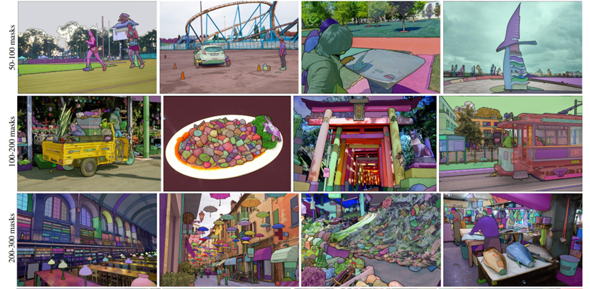

介绍分割领域的大模型 Segment Anything Model (SAM).

<!--more-->

# 1. SAM 概览

- 线上 Demo: https://segment-anything.com/demo

- 源码 Github: https://github.com/facebookresearch/segment-anything

- 支持多种 prompt 用法

  - Foreground / background points
  - Bounding box
  - Mask
  - Text (not released)
  
- 数据集：https://ai.facebook.com/datasets/segment-anything/
  
  - 11 M images
    
    [dataset]: https://segment-anything.com/demo	""what is that"
    
  - 1 Billion + masks
    
    

# 2. 网络结构

